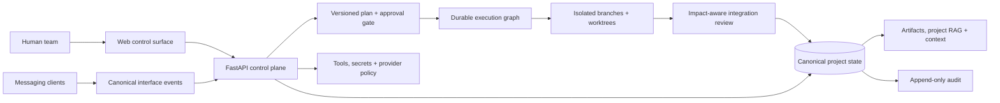

<div align="center">

# Zero Develop

**A human-governed control plane for parallel AI software teams.**

Coordinate multiple people and AI agents on one codebase without mixing project state,
identity, context, memory, or working trees.

[](https://www.python.org/)
[](https://fastapi.tiangolo.com/)
[](docs/CURRENT_STATE_LEDGER.md)
[](#current-status)

[Quick start](#quick-start) · [How it works](#how-it-works) · [Current status](#current-status) · [Architecture decisions](docs/decisions/)

</div>

---

Zero Develop is not another single-agent coding CLI. It is the authoritative backend for a
collaborative development system where humans approve plans and specialized agents execute a
durable task graph in isolated Git worktrees.

The project keeps the important things outside model context: identity, authorization, plans,
execution state, project memory, retrieval provenance, tool policy, provider accounting, and
audit history. Models and interfaces can change without becoming the source of truth.

> [!IMPORTANT]
> This repository is an **audited Phase 9 development checkpoint**, not a production release.
> Core contracts are exercised by deterministic local tests. Live provider and messaging
> integrations, production deployment, and several concurrency hardening requirements remain
> unverified. See [Current status](#current-status) before adopting it.

## Why Zero Develop

| Principle | What it means in practice |
|---|---|
| **Humans authorize execution** | No execution starts until an authorized human approves a specific plan revision. |
| **Parallel work stays isolated** | Concurrent tasks use separate branches and Git worktrees rather than sharing a writable directory. |
| **One control plane, many interfaces** | The website, API, and messaging adapters project the same backend state and policy. |
| **Agent teams follow the project** | Project-specific agent types can be created, split, merged, retired, and rolled back with knowledge provenance. |
| **Context is a budgeted view** | Project RAG, retrieval ledgers, named context regions, and compaction operate on canonical project records. |
| **Trust is enforced server-side** | Stable IDs, project-scoped authorization, capability grants, secret references, and append-only audit events do not depend on UI hiding or agent self-report. |

## How it works



A change moves through the system as an evidence-bearing workflow:

1. A human request becomes a canonical conversation event.
2. The planning boundary creates a versioned proposal tied to source events.
3. An authorized human approves, rejects, or revises the exact current revision.
4. The worker converts an approved handoff into a dependency-aware task graph.
5. Ready tasks run in isolated Git worktrees with command, diff, and test artifacts.
6. Integration review checks the impact set, contracts, combined tests, and human conflicts.
7. Only accepted changes may update integrated state, project knowledge, and audit history.

## What is implemented

The current source tree contains working local implementations for:

- **Identity and project isolation** — stable Zero user IDs, external identity links,
  memberships, and project-scoped access.
- **Authorization and audit** — backend permission checks, append-only redacted events, and
  correlation-aware history.
- **Plans and execution** — immutable plan revisions, approval/rejection gates, durable task
  dependencies, retries, cancellation, snapshots, and restart recovery.
- **Isolated development** — repository registration, branch/worktree creation, command
  execution, diff capture, and cleanup protections for uncommitted human work.
- **Dynamic agent topology** — project-specific agent types, concurrency limits, knowledge
  records, split/merge/retire operations, snapshots, and rollback.
- **Artifacts and context** — content-addressed artifacts, project-scoped RAG, retrieval
  provenance, token budgets, context versions, and compaction records.
- **Tools, secrets, and providers** — capability-scoped tool grants, encrypted secret storage,
  canonical provider contracts, request deduplication, and usage accounting.
- **Integration and interfaces** — impact-aware merge gates, an HTML control surface, REST API,
  and canonical Telegram/Discord-style event contracts.
- **Operational foundations** — health/readiness probes, low-cardinality metrics, secret-canary
  scans, backup/restore helpers, and recovery services.

The web surface includes project, membership, plan, execution, agent-topology, and audit views.
Interactive API documentation is available from the running application at `/docs`.

## Quick start

### Prerequisites

- Git
- [uv](https://docs.astral.sh/uv/getting-started/installation/) — manages the required Python
  **3.12+** environment

### Run locally

```bash
git clone https://github.com/mhrsdev/zero-agent-dev-telegram.git
cd zero-agent-dev-telegram

uv venv --python 3.12
source .venv/bin/activate
uv pip install -e ".[dev]"

export ZERO_ENV=development
zero-develop serve

# Bare start also works: with ZERO_ENV unset, `serve` assumes the
# development defaults above (local SQLite, loopback bind) and prints
# a notice. Production still requires explicit configuration.
# zero-develop serve --host 127.0.0.1 --port 8000
```

Open:

- Web control surface: <http://127.0.0.1:8000/web/>
- Interactive API docs: <http://127.0.0.1:8000/docs>
- Health probe: <http://127.0.0.1:8000/healthz>
- Readiness probe: <http://127.0.0.1:8000/readyz>

You can also start the ASGI application directly:

```bash
ZERO_ENV=development uvicorn zero.main:app --reload
```

### Run the verification suite

```bash
ZERO_ENV=test PYTHONDONTWRITEBYTECODE=1 PYTHONPATH=src \
  python -m pytest -rA -p no:cacheprovider
ruff check --no-cache src tests scripts
ruff format --check --no-cache src tests scripts
PYTHONDONTWRITEBYTECODE=1 python -m compileall -q src tests scripts
```

The test suite uses isolated SQLite state and exercises the same application factory used by the
runtime. A release build must also pass the clean-artifact gate. Build from a clean committed Git
tree so untracked or dirty checkout files cannot enter the release:

```bash
release_source="$(mktemp -d)"
rm -rf dist
mkdir -p "$release_source"
test -z "$(git status --porcelain --untracked-files=all)"
git archive --format=tar HEAD | tar -x -C "$release_source"
python -m build --outdir dist "$release_source"
python "$release_source/scripts/validate_release_artifacts.py" dist
```

That gate checks the wheel and source distribution independently for all 30 migration files and
the runtime modules required by the application entry point.

## Configuration

Configuration is a typed, fail-closed trust boundary. The console and ASGI entry points read
process environment variables; `.env.example` is a reference template and is not loaded
automatically. Never commit a real `.env`.

| Variable | Required | Purpose |
|---|---|---|
| `ZERO_ENV` | Always | Selects `development`, `test`, or `production`. |
| `ZERO_DATABASE_URL` | Production | Explicit database location; development and tests receive isolated defaults. `postgresql://` requires the `[pg]` extra. |
| `ZERO_SECRET_KEY` | Production | Secret material of at least 32 bytes; redacted from representations and logs. `zero setup` bootstraps `$ZERO_HOME/secret.key` + `.env` when absent. |
| `ZERO_LOG_LEVEL` | No | `DEBUG`, `INFO`, `WARNING`, or `ERROR`. |
| `ZERO_AUTH_REQUIRED` | No | Defaults to enabled in production and disabled elsewhere. |
| `ZERO_BOOTSTRAP_TOKEN` | When protected bootstrap is used | Authorizes first-user bootstrap without storing the raw token in application state. |
| `ZERO_PANEL_PORT` | No | Port for the engine/admin GUI (default `8000`); the TUI reads the same value. |
| `ZERO_SANDBOX_EXECUTOR` | No | `none` (default), `docker`, or `firejail`. Required for worktree commands in production. |
| `ZERO_SANDBOX_IMAGE` | No | Pinned container image for the docker sandbox (default `python:3.12-slim`). |
| `ZERO_TELEGRAM_MODE` | No | `bot_api` (default) or explicit `user_session` opt-in (needs `[session]` extra). |
| `ZERO_TELEGRAM_API_BASE` | No | Override for Bot API base (self-hosted gateways / tests). |
| `ZERO_MCP_SERVERS` | No | JSON array of MCP stdio servers to expose as tools. |
| `ZERO_CHAT_RATE_LIMIT_PER_MIN` | No | Admin chat endpoint budget per minute (default `10`). |
| `ZERO_DECOMPOSITION_ENABLED` | No | Opt-in LLM plan decomposition (`1`/`true`). |
| `ZERO_TOOL_APPROVAL_MODE` | No | Per-call tool approval gate (`off` default / `manual`). Manual mode consults a durable gate before every declared tool call in task executions: hardline floor, deny rules outrank allows, pending queue answerable at `GET/POST /projects/{id}/tool-approvals`. |
| `ZERO_PG_POOL_MIN` / `ZERO_PG_POOL_MAX` | No | PostgreSQL pool bounds (defaults `2`/`20`). |
| `ZERO_ENABLE_LIVE_TESTS` | No | Must be `1` plus credentials to run `tests/integration_live`. See [docs/LIVE_TESTING.md](docs/LIVE_TESTING.md). |

Optional extras: `[tokenizer]` tiktoken counting, `[pg]` PostgreSQL,
`[mcp]` Model Context Protocol, `[session]` user-session Telegram,
`[tui]` terminal UI.

Production mode refuses missing secrets, in-memory persistence, and development database paths.
See [ADR 0004](docs/decisions/0004-configuration-as-trust-boundary.md) for the full contract.

## Current status

`VERIFIED` means deterministic local verification in the Phase 9 source tree. It does **not**
mean production readiness.

| Area | State | Evidence boundary |
|---|---|---|
| Identity and project isolation | Verified | Backend and authenticated HTTP isolation tests |
| Authorization, secrets, tools, and audit | Partial | Core policy and redaction pass; arbitrary in-process handler timeouts are unsupported |
| Plans and durable execution | Partial | Lifecycle, graph, retry, and recovery pass; concurrency races remain |
| Git worktree isolation | Verified | Local Git/worktree tests |
| Dynamic agent topology | Partial | Lifecycle and rollback pass; concurrency and complete knowledge rollback need hardening |
| Artifacts, RAG, context, and compaction | Verified | Deterministic local isolation and rebuild tests |
| Provider boundary and accounting | Partial | Deterministic fake adapter only; no live provider or billing truth |
| Integration review and controlled merge | Verified | Local impact, contract, combined-test, and provenance gates |
| Website and messaging interfaces | Partial | ASGI and canonical-event tests; no browser audit or live Telegram/Discord run |
| Operations and rollout | Partial | Recovery helpers pass; production rollout and encrypted product backup are blocked |

Read the full [audited current-state ledger](docs/CURRENT_STATE_LEDGER.md) and
[Phase 9 closeout report](docs/PHASE_9_CLOSEOUT.md) for claim-level evidence.

### Not production ready yet

Production rollout is deliberately blocked until at least the following are complete:

- encrypted product-level backups and a rehearsed restore procedure;
- live provider, Telegram, and Discord validation;
- browser, mobile, and accessibility testing;
- concurrency and linearizability hardening around plan approval, task claiming/completion,
  agent limits, provider idempotency, and topology rollback;
- production deployment, TLS, supervision, external persistence, and disaster-recovery rehearsal;
- a clean tracked-artifact build and installed-wheel startup gate;

The current `BackupService` produces an authenticated encrypted backup only when a stable configured
`ZERO_SECRET_KEY` is available. Without that encryption authority, backup and restore fail closed.

## Repository layout

```text
zero-agent-dev-telegram/
├── docs/
│   ├── decisions/             # architecture decision records
│   ├── CURRENT_STATE_LEDGER.md
│   ├── REQUIREMENT_LEDGER.md
│   └── PHASE_*_CLOSEOUT.md
├── src/zero/
│   ├── domain/                # canonical types, invariants, and state transitions
│   ├── app/                   # application services and FastAPI boundary
│   ├── persistence/           # SQLite repositories and ordered migrations
│   ├── web/                   # server-rendered control surface
│   ├── adapters/              # transport/provider adapter boundary
│   ├── config.py              # typed configuration trust boundary
│   └── main.py                # ASGI and console entry point
├── tests/                     # deterministic unit, HTTP, integration, and E2E tests
├── scripts/                   # development helpers
└── pyproject.toml
```

Dependency direction stays inward: interfaces and adapters call application services; domain
rules remain the canonical center; persistence implements the storage boundary.

## Documentation

- [Usage & operations guide](docs/USAGE.md) — install, configure, run, and drive the full workflow
- [Requirement ledger](docs/REQUIREMENT_LEDGER.md) — confirmed behavior, invariants, and evidence
- [Current-state ledger](docs/CURRENT_STATE_LEDGER.md) — verified, partial, and blocked areas
- [Dependency map](docs/DEPENDENCY_MAP.md) — safe milestone and capability ordering
- [Architecture decisions](docs/decisions/) — 26 ADRs covering identity, execution, context,
  providers, integration, interfaces, security, and rollout
- [Phase 9 closeout](docs/PHASE_9_CLOSEOUT.md) — latest verification and rollout decision

## Development rules

Changes should preserve the control-plane invariants:

- do not start execution without an approved, current plan revision;
- do not share writable workspaces between concurrent tasks;
- do not use display names, usernames, routes, or UI state as authority;
- do not expose raw provider, tool, or user secrets to model context or audit logs;
- do not update memory or RAG from rejected or unintegrated work;
- do not report planned capability as implemented capability.

Before opening a change, run the verification commands above and update the current-state ledger
when the evidence boundary changes.

## License

This project is MIT-licensed; see the root [`LICENSE`](LICENSE) file.
